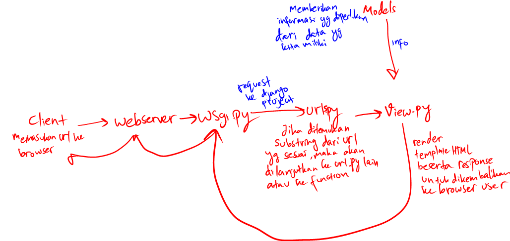
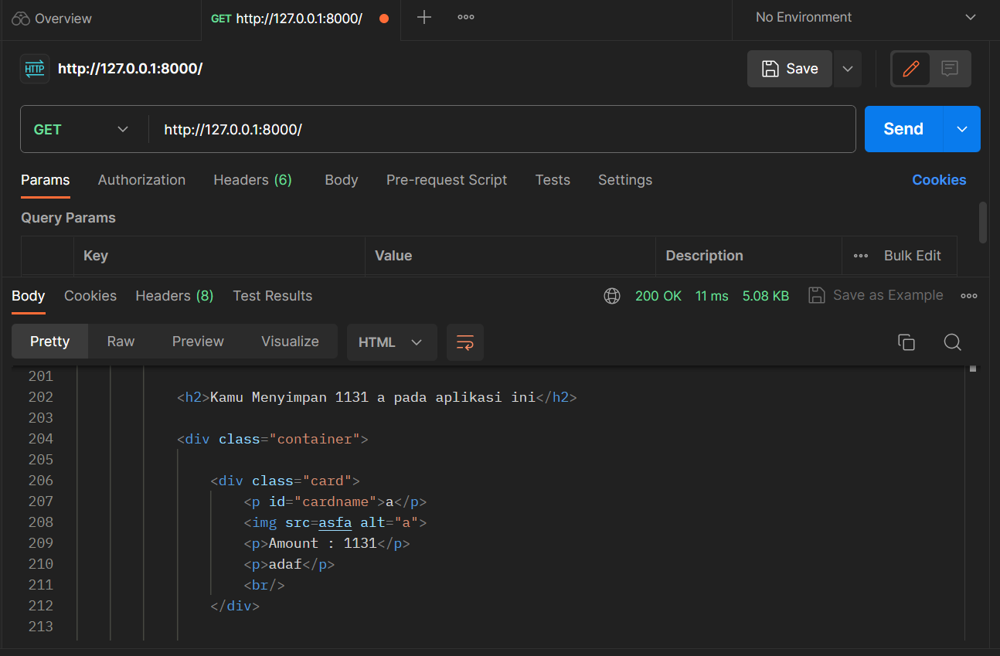
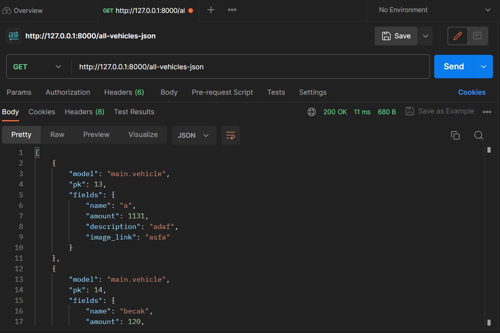
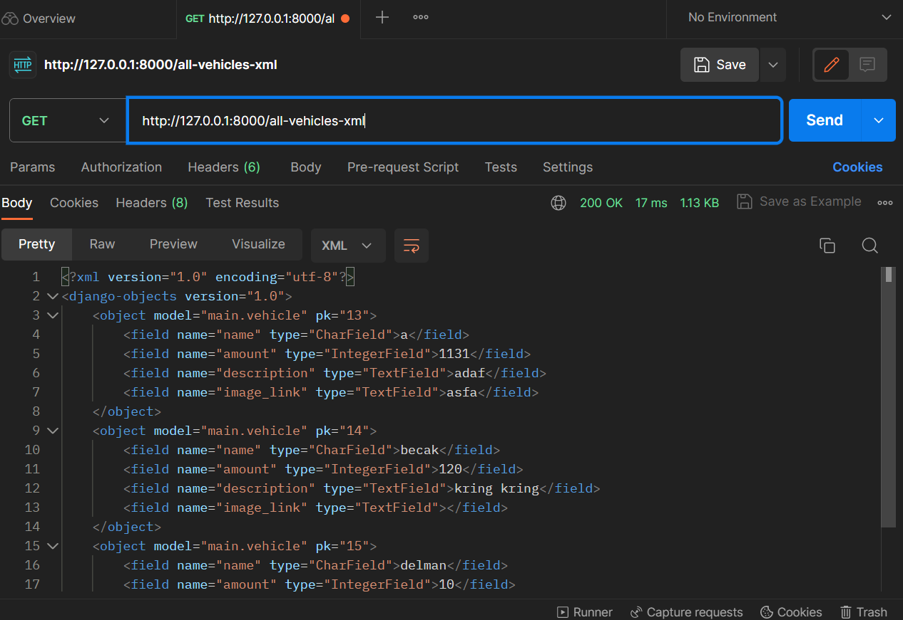
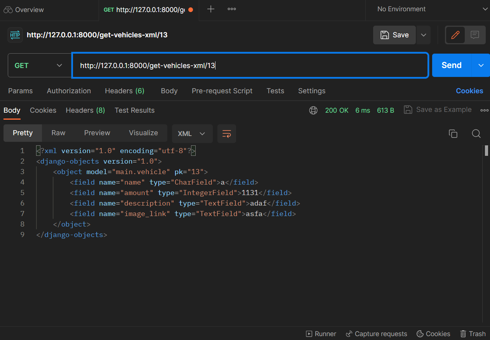
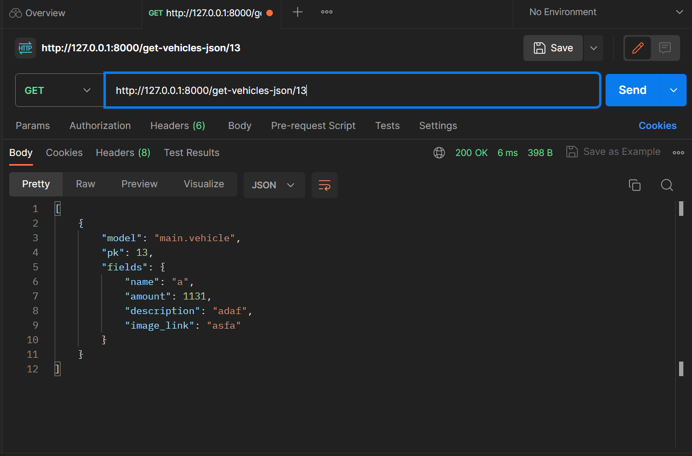
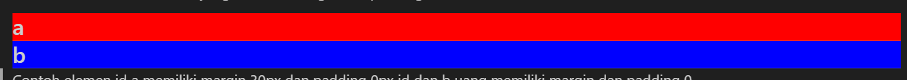
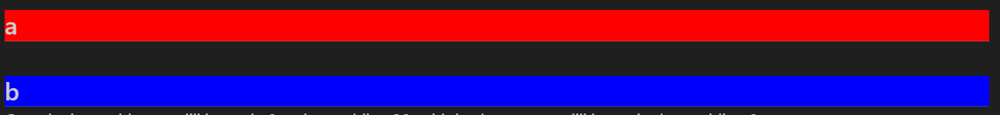
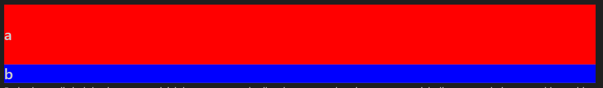

# INVENTORY


TUGAS2
---
Ini adalah repository dari aplikasi web Inventory dengan link -> https://tugas2pbp-inventory.adaptable.app/main
1. Pertama-tama saya membuat repository lokal bernama "UI/Sem3/pbp/tugas2".
   
   Setelah itu saya menyalakan virtual environment dengan menjalankan command ``` python -m venv env ``` pada command prompt.

   Kemudian membuat project dengan line ```django-admin startproject inventory``` di command prompt.

   Setelah project sudah ada, saya lanjutkan dengan membuat app dengan command ```django-admin startapp main```

   Pada file settings.py pada inventory saya menambahkan line
   ```python
   ALLOWED_HOSTS = ['*']
   
   INSTALLED_APPS = [
   ...
   ...
   'main',
   ]
   ```
   
   Saya menambahkan line pada file "urls.py" milik inventory
   ```python
   from django.contrib import admin
   from django.urls import path, include

   urlpatterns = [
   path('admin/', admin.site.urls),
   path('main', include('main.urls'))
   ]
   ```
   dan juga
   ```python
   from django.urls import path
   from .views import main

   app_name='main'

   urlpatterns = [
       path('', main, name='main'),
   ]
   ```
   pada file main/urls.py agar saat client membuat request ke server, client bisa menjangkau app "main".

   Setelah itu saya memasukan line
   ```python
   from django.shortcuts import render
   from .models import Vehicle

   # Create your views here.
   def main(request):
       response = {'name':'KenichiKomala','class': 'PBP D'}
       all_vehicle = Vehicle.objects.all().values()
    
       response['vehicle']= all_vehicle
    
       return render(request, 'main.html', response)
   ```
   pada"views.py" milik app untuk men-return template dan response berisi data dari model.
   Setelah itu saya membuat class Vehicle di "models.py" milik app beserta dengan attribute class-nya. dengan line
   ```python
   from django.db import models

   # Create your models here.
   class Vehicle (models.Model):
       name = models.CharField(max_length=20)
       amount = models.IntegerField()
       description = models.TextField()
       image_link = models.TextField(default="")
   ```
   pada "main/models.py"
   Saya pun menambahkan file "initialize_item.json" untuk membuat instansiasi dari model Vehicle di main. Vehicle di-list pada file tersebut dalam bentuk list of dictionary dan          
   menggunakan command ```django-admin loaddata initialize_item``` sehingga objek dari models terbentuk dan bisa dimasukan ke webpage.
   Setelah itu saya bermain dengan html dan css untuk waktu yang terlalu lama.
   
2. 

   
   
3. Virtual environment digunakan dalam pengembangan aplikasi django untuk mempermudah pengerjaan kita karena kita menghilangkan masalah dari ketergantungan terhadap versi django dan requirements lain
   yang diperlukan untuk program berjalan. Dengan kita membuat virtual environment, segala requirements yang kita download hanya berpengaruh di environment tersebut misalkan jika mengerjakan berbagai
   projek django yang tiap projek dibuat dengan versi django yang berbeda. Dengan adanya virtual environment tiap django yang kita download untuk menyesuaikan versi tiap django projek hanya
   berpengaruh pada masing-masing environment tersebut dan kita tidak perlu berulang-ulang download tiap versi django jika kita mengerjakan projek-projek tersebut secara bergantian. Jadi, virtual
   environment sebenarnya tidak diperlukan untuk menjalankan suatu projek django. Namun, akan sangat membantu saat kita mengerjakan berbagai projek django dengan versi yang berbeda-beda.

4. MVC adalah pola arsitektur dari suatu aplikasi yang memisahkan aplikasi menjadi tiga komponen utama yaitu model, view dan controller.
   Model merupakan bagian yang berhubungan dengan semua logika yang berhubungan dengan data yang dimiliki.
   View merupakan bagian dari aplikasi yang berhubungan dengan tampilan aplikasi dan mengandung elemen seperti semua komponen UI untuk user berinteraksi berserta data yang didapatkan dari controller.
   Controller merupakan bagian yang berfungsi untuk memproses semua request yang masuk serta memanipulasi data dari dan pada model dan mengatur tampilan view serta data yang akan digunakan pada view
   dari model.
   MVT adalah pola arsitektur aplikasi yang memiliki bagian-bagian, yaitu model, view, template.
   Template adalah html yang akan dilihat dan digunakan oleh user. View berguna untuk menerima request dan memberikan response dalam rupa template yang dirender sebelum dikirim ke web browser user.
   Model pada kedua aplikasi ini bersifat sama.
   MVVM digunakan karena developer ingin memisahkan logika program dengan pengaturan user interface. MVVM terbagi menjadi Model, View, dan ViewModel.
   Model memuat program yang digunakan dalam aplikasi yang akan diambil oleh ViewModel ketika view menerima request.
   ViewModel adalah bagian yang menjembatani Model data menuju dan dari view.
   View merupakan bagian elemen yang terlihat oleh user yang mengandung elemen seperti UI, text, animasi, dll. View juga berguna untuk menerima input dari user dan diteruskan ke ViewModel.

   Perbedaan ketiganya adalah dari bagaimana aplikasi yang menggunakannya menjadi terstruktur. Pada aplikasi yang memanfaatkan MVC, model pada aplikasi berguna untuk menyimpan data, view untuk
   mengolah interface yang akan dilihat oleh user dan controller yang berguna untuk memanipulasi data pada dan dari model serta mengatur bagaimana view akan dilihat oleh user. Sedangkan pada MVT,
   model memiliki peran yang sama, tetapi template pada MVT yang memliki peran lebih mirip dengan view pada MVC. View pada MVT berguna untuk menerima request dan membuat template yang sesuai dengan
   reqest tersebut. Sedangkan untuk MVVM, model memiliki peran sumber data untuk aplikasi tersebut dan view adalah tampilan yang memiliki berbagai elemen, tetapi tiap fungsionalitas elemen diatur oleh
   viewmodel. Viewmodel sendiri berguna untuk mengatur semua data yang disalurkan ke view termasuk cara suatu elemen berinteraksi.

TUGAS3
---
1. Perbedaan dari form POST dan form GET adalah dari segi keamanan data. Jika sebuah form menggunakan method
   GET, data akan dapat terlihat di url bar, sedangkan jika form menggunakan method POST tidak dapat terlihat melalui url.
   Perbedaan lain dari POST dan GET adalah saat POST berhasil, akan terkirimkan kode 201 sedangkan GET akan mengirimkan 200.
   Pengiriman data dengan GET juga berbeda dengan POST. GET akan menyimpan data dalam bentuk string sebelum disatukan dengan url, sedangkan form POST akan mengenkripsi data
   sebelumdikirim ke server.
2. Perbedaan dari XML dan JSON ada beberapa hal. XML menggunakan Extensible Markup Language sedangkan JSON  
   didasarkan pada JavaScript. JSON juga tidak bisa memiliki comment pada filenya tidak seperti XML. Data pada JSON disimpan dalam bentuk list of dictionary, sedangkan XML menggunakan
   struktur tag yang membentuk sebuah tree.
   Sedangkan HTML berguna untuk menampilkan data-data tersebut pada webpage client.
3. Alasan mengapa JSON lebih dipilih kebanding XML adalah ukuran file JSON yang lebih kecil karena   
   menggunakan karakter yang lebih sedikit. Syntax JSON yang lebih sederhana membuatnya lebih mudah untuk dibaca sehingga mendukung maintainability dan readbility. Kecepatan, ukuran,       inilah yang menyebabkan JSON lebih dipilih dalam pengiriman data dalam aplikasi web.
4. Saya memulai dengan menambahkan file templates/skeleton.html pada root folder.
   Setelah itu saya mengganti main/templates/main.html menjadi extend templates/skeleton.html. Saya pun juga membuat add_vehicle.html yang juga mengextend skeleton.html dan berisikan
   ```html
   

   
   <h1>ADD VEHICLES</h1>

   <form method="POST">
       
       <table>
           {{ form.as_table }}
           <tr>
               <td></td>
               <td>
                   <input type="submit" value="Add Product"/>
               </td>
           </tr>
       </table>
   </form>
   
   ```
   Setelah itu saya membuat main/forms.py yang berisikan
   ```python
   from django.forms import ModelForm
   from .models import Vehicle
   
   class VehicleForm(ModelForm):
       class Meta : 
           model = Vehicle
           fields = ['name', 'amount', 'description', 'image_link']
   ```
   Setelah itu saya menambahkan berbagai function pada main/views.py
   ```python
   def add_vehicle(request):
       form = VehicleForm(request.POST or None)
   
       print(reverse('main:main'))
       if form.is_valid() and request.method == "POST":
           form.save()
           return HttpResponseRedirect(reverse('main:main'))
       
       response = {'form': form}
       return render(request, "add_vehicle.html", response)
   
   def get_all_vehicle_json(request):
       all_vehicles = Vehicle.objects.all()
       return HttpResponse(serializers.serialize('json',all_vehicles), content_type="application/json")
   
   def get_all_vehicle_xml(request):
       all_vehicles = Vehicle.objects.all()
       return HttpResponse(serializers.serialize('xml',all_vehicles), content_type="application/xml")
   
   def get_vehicle_json(request,id,id2=-1):
       if(id2!=-1):
           all_vehicles = Vehicle.objects.all()
           all_vehicles=list(all_vehicles)
           temp=[]
           for v in all_vehicles:
               if id<= v.pk <=id2:
                   temp+=[v]
           return HttpResponse(serializers.serialize('json',temp), content_type="application/json")
       else:
           all_vehicles = Vehicle.objects.filter(pk=id)
           return HttpResponse(serializers.serialize('json',all_vehicles), content_type="application/json")
   
   def get_vehicle_xml(request,id,id2=-1):
       if(id2!=-1):
           all_vehicles = Vehicle.objects.all()
           all_vehicles=list(all_vehicles)
           temp=[]
           for v in all_vehicles:
               if id<= v.pk <=id2:
                   temp+=[v]
           return HttpResponse(serializers.serialize('xml',temp), content_type="application/xml")
       else:
           all_vehicles = Vehicle.objects.filter(pk=id)
           return HttpResponse(serializers.serialize('xml',all_vehicles), content_type="application/xml")
   ```
   Setelah function-function tersebut sudah dibuat, saya menambahkan path pada urls.py sehingga function-function tersebut dapat diakses dengan url yang tepat.
   ```python
       path('add-vehicle', add_vehicle, name='add_vehicle'),
       path('all-vehicle-json', get_all_vehicle_json, name='get_all_vehicle_json'),
       path('all-vehicle-xml', get_all_vehicle_xml, name='get_all_vehicle_xml'),
       path('all-vehicles-json', get_all_vehicle_json, name='get_all_vehicle_json'),
       path('all-vehicles-xml', get_all_vehicle_xml, name='get_all_vehicle_xml'),
       path('get-vehicles-xml/<int:id>', get_vehicle_xml, name='get_one_vehicle_xml'),
       path('get-vehicles-json/<int:id>', get_vehicle_json, name='get_one_vehicle_json'),
       path('get-vehicles-xml/<int:id>-<int:id2>', get_vehicle_xml, name='get_vehicle_xml'),
       path('get-vehicles-json/<int:id>-<int:id2>', get_vehicle_json, name='get_vehicle_json'),
   ```
5. Berikut adalah hasil dari postman
   
    
    
    
    
    

TUGAS4
---
1. Apa itu Django UserCreationForm, dan jelaskan apa kelebihan dan kekurangannya?
    UserCreationForm dari ```django.contrib.auth.forms``` adalah class yang disediakan oleh django bagi developer agar bisa langsung membuat form registrasi user yang inherit models.ModelForm secara tidak langsung melalui penurunan dari class BaseUserForm. Field yang diberikan oleh UserCreationForm adalah username dan juga password.
    Kekurangan dari penggunaan UserCreationForm untuk membuat form adalah keterbatasan dari fields yang dapat digunakan. Jika misal kita memerlukan user untuk memasukan email, UserCreationForm tidak bisa digunakan. Kita perlu mendefinisikan form sendiri sesuai dengan yang kita inginkan.
2. Apa perbedaan antara autentikasi dan otorisasi dalam konteks Django, dan mengapa keduanya penting?
    Autentikasi pada django adalah sistem yang django sediakan seperti ```django.contrib.auth.authenticate``` untuk memastikan keberadaan user pada database user yang tersedia dan apakah info seperti passwordnya sesuai.
    Otorisasi adalah fasilitas yang django berikan untuk menentukan apa yang bisa dilakukan oleh user yang telah diautentikasi.
3. Apa itu cookies dalam konteks aplikasi web, dan bagaimana Django menggunakan cookies untuk mengelola data sesi pengguna?
    Cookies dalam aplikasi web adalah data yang memuat informasi mengenai user yang telah mengakses sebuah aplikasi web. Fungsi dari cookies adalah untuk mempermudah user yang telah diautentikasi dan otorisasi ke dalam sebuah aplikasi web. Dengan adanya cookies pada sebuah aplikasi, aplikasi tersebut dapat menampilkan kembali preferensi yang dimiliki user tersebut seperti bahasa yang digunakan, atau pada sistem e-commerce, aplikasi tersebut bisa memberikan sugesti berdasarkan produk yang anda liat pada session sebelumnya.
    Cookies pada django juga berfungsi sama. Cookies pada django diimplementasikan menggunakan struktur data dictionary sehingga untuk membuat informasi baru pada cookies milik user, diperlukan method pada response, ```.set_cookie(key, value)```, yang bisa diakses saat request dengan ```request.COOKIES['key']``` pada saat user melakukan request.
4. Apakah penggunaan cookies aman secara default dalam pengembangan web, atau apakah ada risiko potensial yang harus diwaspadai?
    Cookies pada umumnya aman untuk digunakan karena mereka dibuat untuk memfasilitasi user dalam penggunaan aplikasi web tersebut agar pengalaman user menjadi lebih nyaman saat menggunakan aplikasi tersebut. Namun, jika suatu aplikasi rentan terhadap serangan, cookies yang berisi informasi kita bisa dimanfaatkan oleh penyerang. Selain itu, beberapa pihak ketiga bekerja sama dengan berbagai aplikasi web dan mendapatkan informasi dari cookies-cookies tersebut sehingga mereka bisa mendapatkan informasi yang banyak mengenai aktivitas digital dan preferensi kita di internet.
5. Jelaskan bagaimana cara kamu mengimplementasikan checklist di atas secara step-by-step (bukan hanya sekadar mengikuti tutorial).
    Jadi pada awalnya, saya mengimport
    ```python
    from django.contrib.auth.decorators import login_required
    from django.contrib.auth.forms import UserCreationForm
    from django.contrib.auth import login, authenticate, logout
    from django.contrib import messages
    ```
    pada ../main/views.py. Lalu menambahkan function-function untuk memfasilitasi registrasi, login dan logout.
    ```python
    def login_user(request):
    if request.method == 'POST':
        username = request.POST.get('username')
        password = request.POST.get('password')
        
        user = authenticate(request, username=username, password=password)

        if user is not None:
            login(request, user)
            response = HttpResponseRedirect(reverse('main:main'))
            response.set_cookie('last_login', str(datetime.datetime.now()))
            return response
        else:
            messages.info(request,'fail to login')
    return render(request, 'login.html', {})

    def register(request):
        # form = UserCreationForm()
        form = UserCreationForm(request.POST)

        # if form.method == 'POST':
            # form = form = UserCreationForm(request.POST)

            # if form.is_valid():
        if form.is_valid() and request.method == 'POST':

            form.save()
            
            response = HttpResponseRedirect(reverse('main:login'))
            messages.success(request, 'YEY!')

            response.set_cookie('last_login', str(datetime.datetime.now()))

            return response
        
        response = {'form':form}
        return render (request, 'register.html',response)

    def logout_user(request):
        logout(request)
        response = HttpResponseRedirect(reverse('main:login'))
        response.delete_cookie('last_login')
        return response
    ```

    selain itu, saya juga mengubah function main dengan menambahkan
    ```python
    response = {'name':request.user.username,'class': 'PBP D'}
    all_vehicle = Vehicle.objects.filter(user = request.user)
    ...
    response['session']=request.COOKIES['last_login']
    ```

    pada function add_vehicle(request) juga ada perubahan kode, yaitu
    ```python
    vehicle = form.save(commit=False)
    vehicle.user = request.user
    ```
    untuk menyimpan informasi user yang memasukan objek tersebut.

    Pada ../main/urls.py diperlukan ditambahkan
    ```python
    path('login/', login_user, name='login'),
    path('logout/', logout_user, name='logout'),
    path('register/', register, name='register'),
    ```
    agar saat urls tersebut dimasukkan oleh user dapat diberikan response yang tepat.

    Pada ../main/models.py ditambahkan 1 line untuk menyimpan informasi user yang mendaftarkan objek
    ```python
    user = models.ForeignKey(User, on_delete=models.CASCADE)
    ```

    Setelah itu semua, perlu dipersiapkan templates html untuk di-render saat user membuat request registrasi/login/logout. Jadi dibuat file login.html yang berisi
    ```html
    
    
        <title>Login</title>
    

    
        <div class = "login">

            <h1>Login</h1>

            <form method="POST" action="">
                
                <table>
                    <tr>
                        <td>Username: </td>
                        <td><input type="text" name="username" placeholder="Username" class="form-control"></td>
                    </tr>
                            
                    <tr>
                        <td>Password: </td>
                        <td><input type="password" name="password" placeholder="Password" class="form-control"></td>
                    </tr>

                    <tr>
                        <td></td>
                        <td><input class="btn login_btn" type="submit" value="Login"></td>
                    </tr>
                </table>
            </form>

            
                <ul>
                    
                        <li>{{ message }}</li>
                    
                </ul>
                 
                
            Don't have an account yet? <a href="">Register Now</a>

        </div>

    
    ```
    , file register.html yang berisikan
    ```html
    
    
        <title>Register</title>
    

    
    <style>
        h1{
            color:white;
            font-size:300%;
        }
        .container{
            font-family: Arial,'Montserrat', Helvetica, sans-serif;
            margin:5%;
            display : flex;
            flex-direction: column;
            align-items:center;
            background-color:#43B972;
            padding:20px;
            border-radius:50px;
        }
        .submit{
            border-radius:4%;
            padding:1% 5% 1% 5%;
            border:0px;
            background-color:#213150;
            color:antiquewhite;
        }

        input{
            border-radius:5%;
        }

        body{
            background:antiquewhite;
        }

    </style>
        <div class = "container">
            <h1> Register </h1>
                <form  method="POST" class="form">
                
                {{form.as_p}}
                <input type = "submit" value="Register" class="submit" name="submit">
                </form>
            
                <p>{{m}}</p>
            
        </div>
    
    ```
    , dan terakhir pada main.html ditambahakn line agar diketahui informasi mengenai sessionya.
    ```html
    ...
    <header>
        <div class="home">
            <h1>We Want<br/><span class="red">Vehicles</span></h1>
            <p>Vehicle database</p>
            <p class="session">session : {{session}}</p>
        </div>
    </header>
    ...
    ```

TUGAS 5
---
1. Terdapat tiga jenis selector dalam CSS. Pertama adalah selector elemen, kedua adalah selector id, dan
terakhir adalah selector class.
Selector elemen dituliskan dengan menuliskan tag html yang ingin diformat dan menuliskan properti css yang diingikan didalam kurung kurawal {}. Misal,
    ```html
    <style>
        p {
            color:#FFFFFF;
            font-family:Arial;
            padding:100px;
            ...
        }
    </style>
    ```
    Selector tersebut cocok untuk digunakan jika kita ingin membuat semua tag yang sama pada dokumen htmlnya menjadi memiliki properti css yang dituliskan. Seperti misal dengan contoh diatas, semua elemen paragraf akan berubah menjadi warna putih, font arial, dan memiliki padding 100px.
    Misal pada suatu website kita mau semua tulisan kita menggunakan font arial maka kita tulis dengan
    ```html
    <style>
        p, h1, h2, h3{
            font-family:Arial;
        }
    </style>
    ```
    Untuk jenis kedua yaitu, id selector cocok digunakan ketika kita ingin mengubah hanya satu elemen pada dokumen kita atau misal pada website kita memang hanya memiliki satu elemen tersebut seperti sebuah navigation bar. Suatu id hanya bisa dimiliki oleh satu elemen html sehingga cocok jika kita ingin memberikan properti padanya dengan menggunakan id selector. Misal
    ```html
    <style>
        #navbar{
            display:flex;
            flex-direction:row;
            justify-content:space-between;
            align-items:center;
        }
    </style>
    <body>
        <div id = "navbar">
            <h1>judul</h1>
            <p>contact</p>
        </div>
    </body>
    ```
    Kita juga bisa mengakses elemen di dalam sebuah id baik tag biasa, id lain atau class dengan menuliskannya disebelah idnya, seperti:
     ```html
    <style>
        ...
        #navbar h1{
            font-family:Arial;
            color:antiquewhite;
        }
    </style>
    <body>
        <div id = "navbar">
            <h1>judul</h1>
            <p>contact</p>
        </div>
    </body>
    ```
    Yang ketiga adalah class selector yang cocok digunakan jika kita memiliki beberapa bagian dalam satu dokumen html yang perlu memiliki property sama. Misal kan kita memiliki forum dan kolom komentar yang memiliki properti serupa, maka kita bisa menggunakan class.
    ```html
    <style>
        chats{
            padding:0px;
            margin:0px;
            box-sizing:border-box;
        }
    </style>
    <body>
        <div class="chats">
            <h1>Forum</h1>
        </div>
        <div class="kolomKomentar">
            <h1>Kolom Komentar</h1>
        </div>
    </body>
    ```
    Kita juga bisa mengakses elemen di dalam sebuah class layaknya dengan selector id dengan cara yang sama.
2. Saat pertama kali mengetik html kita selalu memulainya dengan \<html\>\</html\> yang berfungsi sebagai 
   root dari semua elemen pada dokumen dan menjadi penampung semua elemen.
   Setelah itu ada tag \<head\> yang berfungsi untuk memberikan informasi mengenai website seperti judulnya, dan data meta nya.
   
   Setelah itu ada tag \<body\> yaitu tag yang menampung elemn yang akan muncul pada website.  
   Tag header memiliki banyak jenis, h1,h2,h3,h4,h5,h6 yang berfungsi untuk menampilkan font dengan ukuran 
   yang lebih besar dan lebih tebal. Semakin kecil angkanya semakin besar ukurannya. Misalkan,
   \<h1\>"JUDUL"\<h1\> akan menampilkan 

   <h1>"JUDUL"</h1>

   Selanjutnya ada tag \<p\> atau paragraf yang berfungsi untuk menampilkan teks biasa.
   
   Tag \<div\> berguna untuk mengelompokan berbagai elemen menjadi satu kelompok sehingga untuk dimanipulasi dengan css lebih mudah.
   
   Tag \<input\> berfungsi untuk membuat input field yang dapat berupa text field pendek, panjang, button, radio, dll. Tag input biasa digunakan dalam tag \<form\> sehingga data yang dimasukan ke form dapat diambil dan dikirimkan ke server.
   
   Terdapat juga tag \<a\> yang berguna untuk menampilkan link. Misalkan \<a href="https://os.vlsm.org/"\> link \</a\> akan menampilkan 
   
   <a href="https://os.vlsm.org/">link</a>

   dan tag  \
   
   

   yang beguna untuk menampilkan gambar

3. Perbedaan dari margin dan padding adalah margin merupakan area diluar dari border suatu elemen yang bersifat kosong, sedangkan padding merupakan bagian didalam border elemen. Margin dapat dibayangkan sebagai jarak satu elemen ke elemen lain.
    
    Contoh elemen id a dan id b yang memiliki margin dan padding 0
    

    Contoh elemen id a memiliki margin 30px dan padding 0px id dan b uang memiliki margin dan padding 0
    

    Contoh elemen id a memiliki margin 0px dan padding 30px id dan b uang memiliki margin dan padding 0
    

4. Perbedaan tailwind dan bootstrap adalah bootstrap memberikan komponen dan class css yang telah dirancang sebelumnya sehingga bisa langsung digunakan di dalam aplikasi web, misalkan button, text dan lain-lain. File bootstrap cenderung besar akibat ini karena bootstrap menyediakan berbagai macam komponen siap pakai. Namun, karena hal tersebut bootstrap menjadi lebih susah untuk berkreativitas karena css milik komponen bootstrap tidak bisa kita edit secara lokal.
   Sedangkan untuk tailwindcss memberikan kelas-kelas utilitas yang dapat kita gunakan sendiri untuk membuat komponen yang kita inginkan. Karena tailwindcss hanya menyediakan alat utilitas, maka cenderung ukurannya lebih kecil dari bootstrap. Namun, karena hal ini juga pembelajaran akan tailwind lebih sulit kebanding bootstrap yang hanya tinggal digunakan.

5. Jadi yang pertama saya tambahkan adalah
   ```python
   STATIC_ROOT = os.path.join(PROJECT_ROOT, 'static')
   STATIC_URL = 'static'
   ```
   pada file settings.py di inventory/
   Lalu saya menghias login.html saya dengan menambahkan external css bernama test.css di ./main/static.
   ```css
   .login{
    background-color:#EEEEEE;
    width:40%;
    margin:20px;
    padding:5px 10px 20px 10px;
    }
    body{
        background-color:#FCFBFB;
    }
    form{
        color:#071E22;
    }
    ```
    Selain login.html, register.html juga saya hias menggunakan internal css dengan kode sebagai berikut,
    ```css
    <style>
        .judul-form{
            display:flex;
            flex-direction:column;
            align-items:center;
        }
        .badan{
            display:flex;
            flex-direction:column;
            align-items:flex-start;
            margin-left:100px;
        }
        h1{
            font-family:Arial;
            color:#000000;
            font-size:200%;
        }
        .container{
            width:100%;
            font-family: Arial,'Montserrat', Helvetica, sans-serif;
            display : flex;
            flex-direction: column;
            align-items:center;
            background-color:#EEEEEE;
            padding:20px;
        }
        .submit{
            border-radius:4%;
            padding:1% 5% 1% 5%;
            border:0px;
            background-color:#8EC63F;
            color:#FFFFFF;
        }
    
        .form{
            display : flex;
            flex-direction: column;
            justify-content:center;
            margin-bottom:10%;
            color:#071E22;
            font-size:14px;
        }
    
        input{
            border-radius:5%;
        }
    
        body{
            background-color:#FCFBFB;
        }
    
    
    </style>
    ```
    Pada skeleton.html sendiri saya tambahkan navbar sehingga semua file html yang bersumber darinya akan memiliki navbar.
    Pada tag head skeleton.html saya tambahkan internal css dan pada body saya buat div yang memiliki class navbar
    ```css
        <style>
        body{
            margin:0;
        }
        .navbar{
            display: flex;
            flex-direction: column;
            justify-content: space-around;
            align-items: center;
            
            position: sticky;
            top:0;
    
            background-color: antiquewhite;
            font-family: Arial,'Montserrat', Helvetica, sans-serif;
            padding:0% 0% 0% 0%;
            margin:0%;
        }
    
        .navbar #topnav{
            display: flex;
            flex-direction: row;
            justify-content: space-around;
            background-color: #F19A4D;
            width: 100%;
            padding-top: 1%;
            padding-bottom: 1%;
        }
        .navbar #botnav{
            display: flex;
            flex-direction: row;
            justify-content: space-around;
            width: 100%;
        }
    
        .navbar #navbarTitle{
            font-weight: 700;
            font-size: 28px;
            color: antiquewhite;
            text-decoration: none;
        }
        .navbar #navbarAbout{
            margin: 0px;
            position: sticky;
            top: 0;
            font-size: 24px;
            font-weight: 400;
            color: antiquewhite;
        }
    </style>
    ```
    ```html
    <div class="navbar">
        <div id="topnav">
            <a href = "" id="navbarTitle">We Want Vehicles</span></a>
            <p id="navbarAbout">About Us</p>
        </div>
        <div id ="botnav">
        </div>
    </div>
    ```

    Untuk bonus, saya menambahkan line 
    ```html
    
    <div class="cardlast">
        <p id="cardname">{{v.name}}</p>
        
        <a href = "">
            <button>-</button>
        </a>
        <p>Amount : {{v.amount}}</p>
        <a href = "">
            <button>+</button>
        </a>
        <p>{{v.description}}</p>
        <br/>
        <a href = "">
            <button>delete</button>
        </a>
        
    </div>
    
    ...
    
    ```
    sehingga saya bisa memodifikasi khusus objek terakhir pada daftar tersebut

# TUGAS 6

1. Perbedaan dari asynchronous dan synchronous programming adalah program synchronous perlu berjalan tahap demi tahap atau secar asekuensial dimana program perlu menunggu hasil dari program sebelumnya, sedangkan untuk program asynchronous memberikan program untuk berjalan saat program lain masih berjalan sehingga memanfaatkan lebih banyak kemampuan operasi komputer.

2. Event-driven programming adalah cara pemrograman dimana program diutamakan untuk menangani event dari user. Saat suatu event di-triggered, program akan menjalankan function khusus untuk menangani event tersebut yang sudah didekalarasi sebelumnya seperti tombol ditekan, mouse enter, mouse click dan sebagainya. Pada tugas kali ini contoh dari event-driven programming adalah event-handling saat tombol dengan id "button_add" ditekan.
    ```javascript
    document.getElementById("button_add").onclick = addProduct
    ```
Line tersebut meng-assign function addProduct sehingga saat tombol dengan id "button" add ditekan, function tersebut akan dijalankan.
3. Asynchronous programming pada AJAX diterapkan dengan cara saat terjadi sebuah event pada halaman web, javascript akan membuat sebuah request berupa XMLHTTPRequest ke server kemudian setelah server sudah memproses request tersebut akan dikembalikan sebuah response yang akan dibaca oleh javascript. Karena pada AJAX digunakan event listener, response yang dikirimkan oleh server tidak perlu ditunggu agar programnya tetap bisa berjalan. Hal ini menyebabkan program menjadi lebih responsive terhadap user interaction dan bisa diupdate tanpa diperlukannya page reload.
4. Sebagai teknologi yang lebih tua, JQuery memiliki ukuran library yang lebih besar dari fetch karena sudah dikembangkan untuk kurang lebih 15 tahun. Selain itu, JQuery memiliki syntax yang berbeda, untuk menseleksi elemen html, JQuery hanya perlu menuliskan
```JQuery
$("p").click(function(){
  // action goes here!!
});
```
dimana semua tag p akan akan memiliki event handler berupa function. Sedangkan untuk fetch melakukan hal yang sama, perlu diketikan
```javascript
document.getElementById("container").onclick = function
```
Namun, fetch menggunakan Promises untuk memproses handling asynchronousnya sehingga menjadi lebih baik dari pada JQuery yang menggunakan callback.
5. Proses pengerjaan checlist dimulai dengan menambahkan line
```python
def get_product_json(request):
    product_item = Vehicle.objects.filter(user=request.user)
    return HttpResponse(serializers.serialize('json', product_item))

@csrf_exempt
def add_product_ajax(request):
    print("add_product_ajax")
    if request.method == 'POST':
        name = request.POST.get("name")
        amount = request.POST.get("price")
        description = request.POST.get("description")
        image_link = request.POST.get("image_link")
        user = request.user

        new_product = Vehicle(name=name, amount=amount , description=description, image_link=image_link ,user=user)
        new_product.save()

        return HttpResponse(b"CREATED", status=201)

    return HttpResponseNotFound()
```
pada main/views.py, setelah itu dilanjutkan dengan penambahan line di main/urls.py agar function menajdi bisa di akses
```python
path('get-product/', get_product_json, name='get_product_json'),
path('create-product-ajax/', add_product_ajax, name='add_product_ajax'),
```
Lalu pada main/templates/main.html ditambahkan tag script yang berisi javascript untuk memproses event secara asynchronous dengan fetch
```javascript
    async function getProducts() {
        return fetch("").then((res) => res.json())
    }

    
    async function refreshProducts() {
        document.getElementById("container").innerHTML = ""
        const products = await getProducts()
        let htmlString = `<tr>
            <th>Name</th>
            <th>Price</th>
            <th>Description</th>
        </tr>`
        let idx=0
        products.forEach((item) => {
            if(idx===products.length-1){
                //alert("item id:"+item.pk)
                htmlString += `\n<tr class="cardlast">
                    <td>${item.fields.name}</td>
                    <td>${item.fields.amount}</td>
                    <td>${item.fields.description}</td>
                    <td><button id='button-${item.pk}'  onclick="deleteProduct(${item.pk});">delete</button></td>
                </tr>` 
            }else{
                htmlString += `\n<tr>
                    <td>${item.fields.name}</td>
                    <td>${item.fields.amount}</td>
                    <td>${item.fields.description}</td>
                    <td><button id='button-${item.pk}' onclick="deleteProduct(${item.pk});">delete</button></td>
                </tr>` 
            }
            idx+=1
        })
        document.getElementById("container").innerHTML = htmlString
    }

    refreshProducts()

    function addProduct() {
        fetch("", {
            method: "POST",
            body: new FormData(document.querySelector('#form'))
        }).then(refreshProducts)

        document.getElementById("form").reset()
        return false
    }

    document.getElementById("button_add").onclick = addProduct

```
getProducts berguna untuk mendapatkan HTTPResponse dari function main.get_product_json yang kemudian diubah menjadi json. Function refreshProducts berguna untuk menunggu hingga mendapatkan json dari getProducts dan mengupdate html sehingga page website berubah tanpa diperlukannya reloading. Function addProduct berguna untuk menambahkan product ke dalam database django.